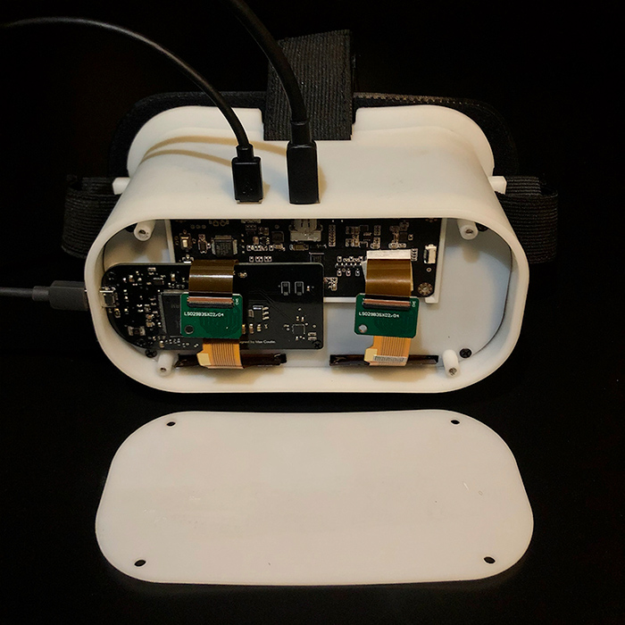
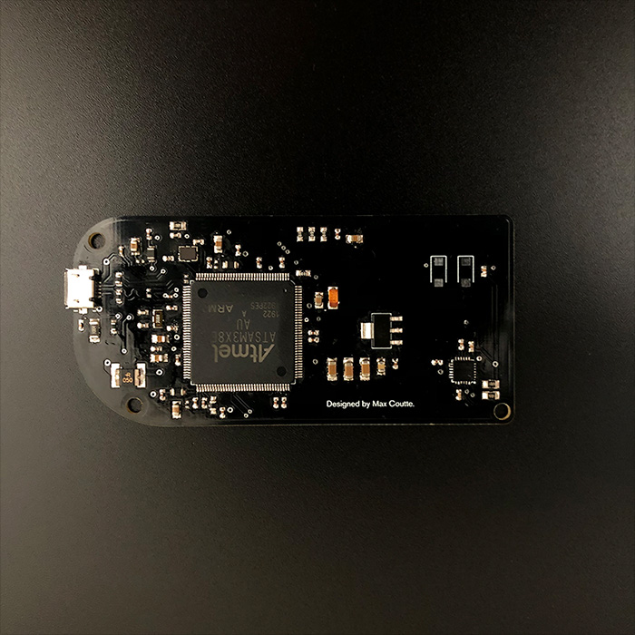
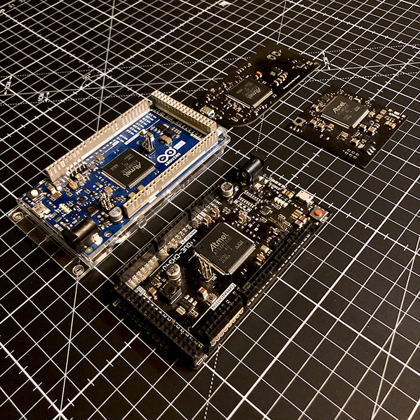
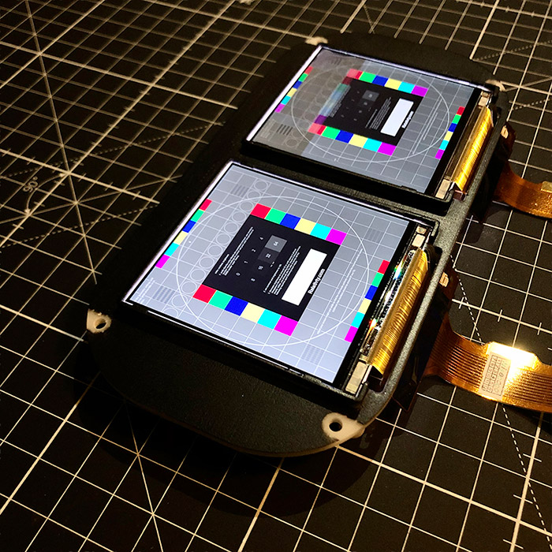
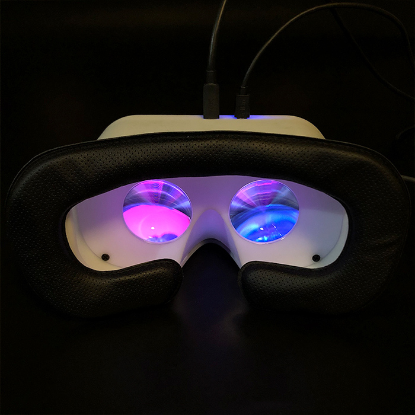

<h1 align="center">
	
</h1>

<h3 align="center">
	Open-source VR headset with SteamVR support.
</h3>
<p align="center">
	<strong>
		<a href="https://relativty.com">Webサイト</a>
		•
		<a href="https://discord.gg/jARCsVb">Discord</a>
	</strong>
</p>

私は<a href="https://twitter.com/maxim_xyz">Maxim xyz</a>です。15歳の時、VRヘッドセットを買う余裕がなかったので親友のGabriel Combeと共に自作しました。

～5年後～
このヘッドセットはRelativtyとなりました。

* 完全にオープンソースな**ハードウェア**, **ソフトウェア**, **ファームウェア**。
* **Steam VR**をサポート。
* **2K**@**120FPS**をネイティブに表示。
* **Arduino**との互換性
* **ボディトラッキング**(試験的)


**このレポジトリはビルドガイドとして用意されています。ヘッドセット自体の詳細については <a>Relativty.com</a> をご覧下さい。**

ハッカーの為の設計
-
Relativtyは**コンシューマ向けではありません**。私たちは自分の寝室で半田ごてと3Dプリンターを使ってRelativtyを作りました。皆さんにも同じように **「自分で作る」** 事を期待しています。

ファームウェア、ソフトウェア、ハードウェアについて詳しく知りたい方は<a href="https://relativty.com">Webサイト</a>をご覧下さい。
また、共に学び、助け合える、フレンドリーな<a href="https://discord.gg/jARCsVb">Discord</a>もあります。
すべてのリンクは<a>relativty.com</a>にあります。

# Relativtyの組み立て

<p align="center">  </p>

# ハードウェアを組み立てる
ハードウェアはAtmel SAM3X8E ARM Cortex-M3プロセッサーを搭載したRelativty Motherboardを使用しており、IMU(慣性計測装置)としてMPU-6050を使用しています。
他にも、ArduinoCoreをサポートし、MPU-6050/MPU-9250に接続されているプロセッサであれば、Relativtyのハードウェアとして使用することができます。
どちらの方法も、以下に説明します。
## Relativty Motherboard使用する場合
### PCBを製造する

まずはPCBを用意します。

<a href="https://jlcpcb.com/">JLCPCB</a>などのサービスで約4$で製造出来ます。

PCBを製造するには製造者へガーバーフォーマット(`Relativty_Electronics_build/GerberFiles.zip`)を渡す必要があります。

### 部品の注文・PCBへの取り付け

部品をPCBへ取り付けていきます。
以下のBOM(部品表)に記された部品を注文する必要があります:
- `Relativty_Electronics_build/Assembly/jlcpcb.com_motherboard_BOM.csv` 
- `Relativty_Electronics_build/Assembly/motherboard_BOM.xlsx`

これらの部品を取り付ける位置は、
`Relativty_Electronics_source/motherboard.brd` に記されています。(Eagleで閲覧出来ます。)

<p align="center">  </p>

#### Arduinoを使用する場合

Relativty Motherboardの代わりに、Arduino Dueを使い、MPU-6050と接続する方法もあります。
```
5V      -> VCC  
GND     -> GND  
SDA(20) -> SDA  
SCL(21) -> SCL  
PIN 2   -> INT  
```

MPU-9250を提供された代替ファームウェアで使用する場合、ピン配置は次のようになります。

```
5V      -> VCC  
GND     -> GND  
SDA(20) -> SDA  
SCL(21) -> SCL   
```

そして、Arduino Dueの「ERASE」と「RESET」ボタンを押すと、Relativtyファームウェアがインストールできるようになります。

#### Relativty Firmwareのインストール

<p align="center">  </p>


ここで、Arduino IDEにRelativtyボードをインストールする必要があります。
そのためには、JSONのURL ( <a>https://raw.githubusercontent.com/relativty/Relativty/master/Relativty_Firmware/package_Relativty_board_index.json</a> ) をコピーして、Arduino IDEを開いてください。

Arduinoで、File、Preferencesの順にクリックします。

- Relativty PCBを使用している場合、Additional Boards ManagerのテキストボックスにJSON URLを追加します。
- `Tools > Board > Board Manager` と進み、Relativty Boardが表示されたらインストールをクリックします。
- Arduino IDEを再起動し、`Tools > Boards` で、Relativtyを選択します。
- これで `Relativty_Firmware/firmware/firmware.ino` を開いてボードにアップロードすることができるようになりました。
- Arduino Dueなどの別のボードを使用している場合は、Relativty_Firmwareをボードにアップロードしてください。

- `Relativty_Firmware\Relativty_board\` の内容をArduino IDEにインストールします。
- MPU-6050の場合、`Relativty_Firmware/firmware/firmware.ino` を使用します。
- MPU-9250の場合、`Relativty_Firmware\MP9250-HID\MP9250-HID\MP9250-HID.ino` を使用します。


# 機械部品の組み立て

## HMDの取り付け
3Dプリントに必要なファイルはすべて`Relativty_Mechanical_build`フォルダにあり、ヘッドセットの組み立てに必要なネジは `screws_BOM.xlsx` にリストアップされています。

私たちはAliexpressを使ってパーツを調達しました。

- <a href="https://www.aliexpress.com/item/33058848848.html">ストラップ</a>, 
- <a href="https://www.aliexpress.com/item/4000199486058.html">フェイスクッション</a>,
- <a href="https://www.aliexpress.com/item/33029909783.html">レンズ</a> (直径40mm/焦点距離50mm).

### HDM用のディスプレイ
<p align="center">  </p>

Relativty Headsetはデフォルトで2K 120Hzのデュアルスクリーンで動作しますが、Relativtyのオープンな性質上どんなスクリーンでも装備することが可能です。

私たちはこのディスプレイをAliexpressで見つけましたが、ベンダーによっては同様の画面が150ドルから190ドルすることがあります。安くディスプレイを手に入れるには、適切な価格で適切なベンダーを探す必要があります。まとめ買いすることで割り引きしてくれる場合もあります。

写真のモデルは[こちら](https://www.aliexpress.com/item/32975198897.html)です。

### ソフトウェアのセットアップ

<p align="center">  </p>

#### SteamVRにRelativty Driverをインストールする。

Relativty Driverは、`Relativty_Driver/Relativty`フォルダの中に入っています。

⚠️ `Relativty_Driver/Relativty/resources/settings/default.vrsettings`を編集する必要があります。

Relativty PCBを使用していない場合、以下を変更する必要があります:

      "hmdPid" : 9,
      "hmdVid": 4617,
	  
これらは、USB HIDデバイスの固有のVendorとProducit Identifieres (pid/vid)です。

Arduino Dueを使用している場合、正しい値は以下のようになります:

      "hmdPid" : 62,
      "hmdVid" : 9025,
	  
別の基板をお使いの場合、正しい値を得るために以下の手順を踏む必要があります:

1. ボードを接続する

2. Arduino IDEでボードを選択し、ツール/ボード情報の取得をクリックすると、以下のような画面が表示されます。

```
	BN: Arduino Due (Native USB Port)
	VID: 2341
	PID: 003e
	SN: HIDHB
```
3. VID番号とPID番号をメモしてください。これらは16進数の値です。

      これを設定するには、int型に変換する必要があります。

      もし、変換の仕方がわからない場合は、様々なオンラインコンバータがあります。

      例えば、https://www.rapidtables.com/convert/number/hex-to-decimal.html 。

4. hmdPidとhmdVidの値を変換後の値に変更します。

次に、ディスプレイの座標と解像度を設定します。

最初は、HMDのディスプレイをデスクトップを拡張したセカンダリ画面として設定してください。

プライマリディスプレイの右上に整列させる。

設定ファイルの "Relativty_extendedDisplay" セグメントで、これらを見つけて設定します。

```
      "windowX" : *whatever your primary screen resolution's width is*,
      "windowY" : 0,
      "windowWidth" : *HMD's native resolution width*,
      "windowHeight" : *HMD's native resolution height*,
      "renderWidth" : *HMD's native resolution width*,
      "renderHeight" : *HMD's native resolution height*,
	  
	  And at the bottom of this segment:
	  
      "IsDisplayRealDisplay" : true,
      "IsDisplayOnDesktop" : true
```  
	  
設定ファイルが破損するので「,」を削除しないで下さい。


ただし、設定ファイルの最後の項目は「,」を削除して下さい。


もし、何らかの理由で上記の設定がうまくいかない場合は、以下の事を試してみてください:


HMDのディスプレイを、プライマリディスプレイのミラーリングディスプレイとして設定します。

以下のように設定を変更して下さい:
```
      "windowX" : 0,
      "windowY" : 0,
      "windowWidth" : *HMD's native resolution width*,
      "windowHeight" : *HMD's native resolution height*,
      "renderWidth" : *HMD's native resolution width*,
      "renderHeight" : *HMD's native resolution height*,
	
      "IsDisplayRealDisplay" : false,
      "IsDisplayOnDesktop" : true
```	
⚠️これにより、キーボード/マウス入力がVRウィンドウにキャプチャされない可能性があります。ゲームでこれらが必要な場合は正常にプレイできなくなるかもしれません。

また、設定ファイル内でIPD（瞳孔間距離）の調整も可能です。

"Relativty_hmd" セグメントを調整します。

```
      "IPDmeters" : 0.063,
```

また、以下を変更することで、レンズの歪み補正を調整することができます。

```
      "DistortionK1" : 0.4,
      "DistortionK2" : 0.5,
```

これでRelativity Driverをインストール出来るようになりました:

`vrpathreg.exe` の位置（通常は `C:/Steam/steamapps/common/SteamVR/bin/win64/vrpathreg.exe` ）を確認します。
- 次に、Windowsのコマンドプロンプトを開いて、以下のコマンドを実行します:

      cd C:/Steam/steamapps/common/SteamVR/bin/win64
      vrpathreg.exe

ここでは仮に `Relativty_Driver/Relativty` フォルダが `C:/code/Relativty_Driver/Relativty` にあるとします。
- `vrpathreg adddriver C:/code/Relativty_Driver/Relativty` を実行します。

これでRelativty Driverがインストールされました。次のコマンドを実行することでアンインストール出来ます。
- `vrpathreg removedriver C:/code/Relativty_Driver/Relativty`

#### 試験的な3Dトラッキングのセットアップ

このトラッキングはまだ実験的なもので、CUDAを使用しているためNVIDIA製GPU上でのみ実行可能です。このトラッキングは、ビデオ入力と3Dボディポジションを推定するために学習させたArtificial Neural Network AIを使用しています。

この方法は、専用センサーの精度や動きの自由度には及びませんが、モデルを学習させれば、桁違いに改善できると考えています。

まず、ウェブカメラをコンピュータに接続し、Python 3.8.4をインストールし、パスに追加するオプションを選択する必要があります。次に、`PyTorch` をインストールします。以下のコマンドを実行する事でインストールできます。

`python -m pip install torch===1.6.0 torchvision===0.7.0 -f https://download.pytorch.org/whl/torch_stable.html`

次に `CUDA Toolkit 11.0.` をインストールします。

次に、https://github.com/relativty/Relativty/releases から `PYTHONPATH` フォルダをダウンロードし、その場所を `JSON Relativty_Driver/Relativty/resources/settings/default.vrsettings` 内の `PyPath` に追加する必要があります。

`tracking`を1に設定するとトラッキングが有効になり、0にすると無効になります。これはカメラによってキャリブレーションを行うことができます。また、 `scalesCoordinateMeter` と `offsetCoordinate` を調整することで微調整する事ができます。`scalesCoordinateMeter` はAIによって計算された座標軸を1メートル動かしたときの正規化後のデルタに相当します。


**Note** MPU9250ファームウェアを使用する場合はドライバで`hmdIMUdmpPackets`を`false`に設定して、ファームウェアを切り替えるのを忘れないようにしてください。

`"hmdIMUdmpPackets":  false,`

## 最後のステップ

これですべての設定が完了し、プレイを開始することができます。

Relativtyを使い始めるには...
- ヘッドセットを平らな場所に置き、フロントパネルが地面と向き合うようにします。
- ヘッドセットを差し込んでください。数秒後に自動的にキャリブレーションされます。

これでどんなSteamVRも実行できるようになりました！
