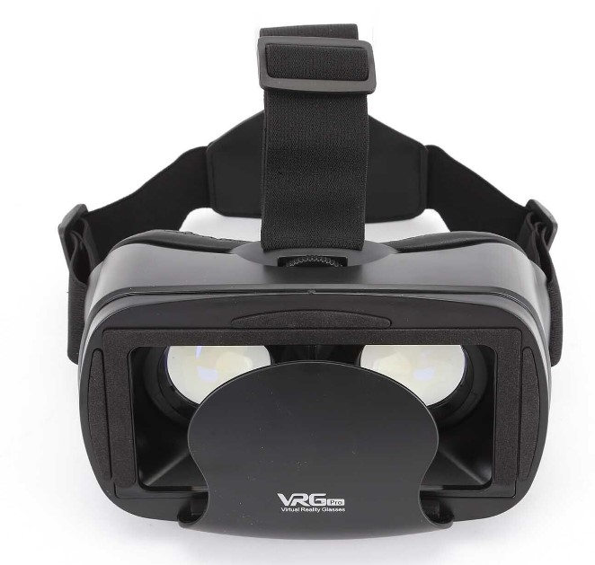
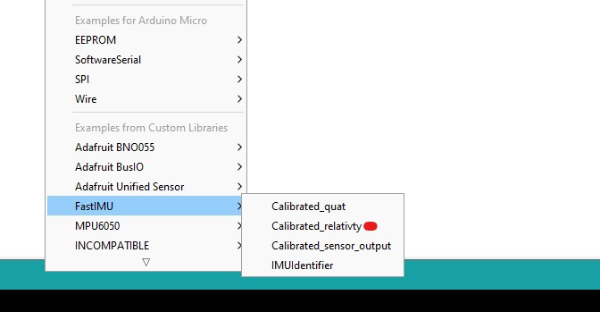
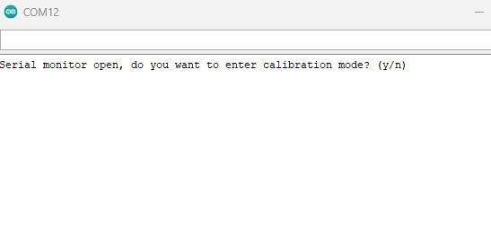
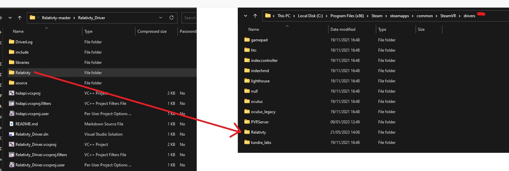
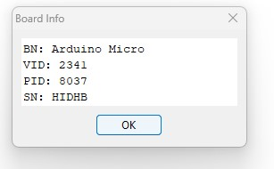
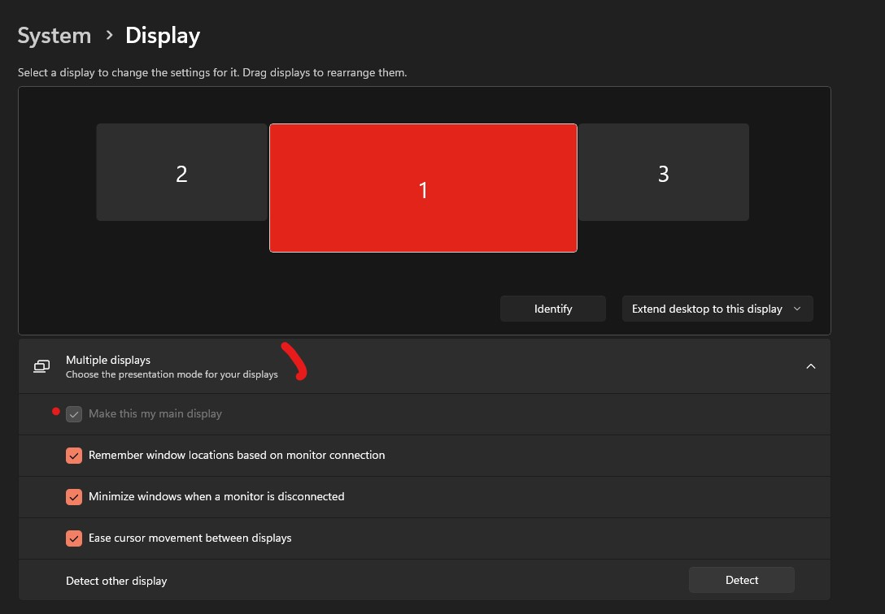
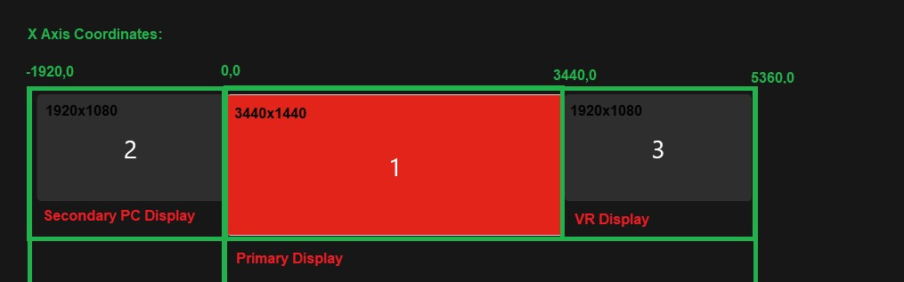
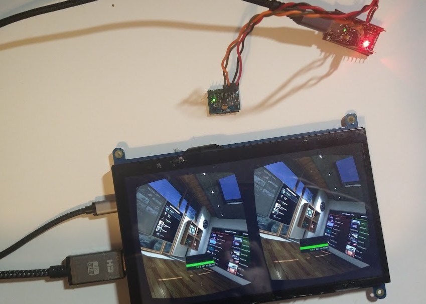
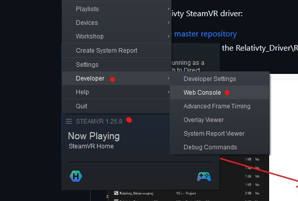

<h1 align="center">
	
</h1>

<h3 align="center">
	Free and Open-source VR headset with SteamVR support.
</h3>
<p align="center">
	<strong>
		<a href="https://relativty.com">Website</a>
		•
		<a href="https://discord.gg/jARCsVb">Discord</a>
	</strong>
</p>

I’m <a href="https://twitter.com/maxim_xyz?lang=en">Maxim xyz</a> and when my best friend Gabriel Combe and I were 15 years old we built our own VR headset because we couldn't afford to buy one.

5 years later : this headset became Relativty.

* GPLv3-compatible - **Free hardware Design**, **Free Software**, **Free Firmware**.
* **Steam VR** support.
* Natively displays **2K** resolution at **120FPS**.
* Compatible with **Arduino**.
* Experimental **Body-Tracking**


**This repo serves as a Build guide, to learn more about the headset see you at <a href="https://relativty.com">Relativty.com</a>**

Made for Hackers
-
Relativty is **NOT A CONSUMER PRODUCT**. We made Relativty in my bedroom with a soldering iron and a 3D printer and we expect you to do the same: **build it yourself**.

Relativty at its basics is a 3 Degrees of Freedom (3-DoF) VR headset with no built-in controller support, designed to work with SteamVR.
This may limit its practical usability for games that demand knuckle-style VR controllers.
If you are looking for a more full-featured DIY VR project 6-Dof tracking and controller support, we recommend you check out <a href="https://github.com/HadesVR/HadesVR">HadesVR</a>.

Whether or not you are building either Relativty or HadesVR, or if you just want to join our community and hang out, we invite you to <a href="https://discord.gg/F8GNKjy6RF">Relativty's Guild on Discord</a>.

It is a place for the DIY/Open-Source VR community to learn, grow, share knowledge, and ask for help. 

# Start Building Relativty

<p align="center">  </p>

# Building The Hardware
## 1. CURRENT RECOMMENDED BUILD - As of May 2023
### 1.1 Introduction
This is an updated build guide to help people who recently discovered Relativty. It aims to explain how to build the minimum functional product, which can be further improved upon and modified to the individual's liking. The original build guide can still be found further below.

            Following this guide to build a Relativty headset assumes basic understanding of electronics and programming Arduino boards.
            A VR headset is a complex system and can be difficult to figure out what is not working if you get stuck with the build.
            If you encounter any issues, join our Discord and ask for help, we are happy to assist.

### 1.2 ELECTRONICS

The following electronic components are required:

- ATmega32U4 Microcontroller (MCU) with USB HID support, such as an <a href="https://www.amazon.co.uk/diymore-Atmega32U4-Development-Microcontroller-Header/dp/B0BKGSVX2X">Arduino Pro Micro</a>
- Inertial Measurement Unit (IMU) that is supported by the <a href="https://github.com/LiquidCGS/FastIMU">FastIMU Library</a>
- A small, high resolution and high refresh rate PC display + driver board. <a href="https://github.com/HadesVR/HadesVR/blob/main/docs/Headset.md#displays">This segment of the HadesVR documentation presents possible good options you can choose from</a>. It is important to note that these displays connect to a DRIVER BOARD, which then connects to your computer. ALWAYS purchase the driver board and display(s) in the same bundle if you can to ensure they are compatible with each other. If you have further questions about displays, join us at <a href="https://discord.gg/F8GNKjy6RF">Relativty's Guild on Discord</a>.
```
NOTES on VR DISPLAYS:
- The display does not connect to the Microcontroller, it only connects to the Computer running your VR Apps.
- Technically, any PC display/monitor can be configured as the display used by Relativty. Therefore, you can simply test your build on your PC monitor
first to make sure it works, before you decide to spend a significant amount of money on lenses, display(s) and other parts.
- High performance, small form factor displays are expensive, and often very delicate. Handle them with care! :)
```

### 1.2.1 Wiring the IMU and MCU
The IMU needs to be connected to the MCU for power and communication.
The MCU connects to your computer via USB to send the IMU readings to SteamVR.

In case of an Arduino Pro Micro, you need to connect the following pins:
```
Pro Micro       IMU
VCC         ->  VCC  
GND         ->  GND  
SDA(pin 2)  ->  SDA  
SCL(pin 3)  ->  SCL  
```  
If you use a different MCU, the SDA and SCL pins might be mapped to different pin numbers.

Also, make sure that the VCC of your MCU is compatible with the rated operating voltage of your IMU.

Supplying incorrect voltage to electronic components may cause damage to them.

The MCU itself simply connects to your computer via the USB port.

### 1.2.2 Connecting the display
As mentioned previously, any display that is compatible with a personal computer should be able to function as your VR display.

In case you are using the recommended one or a similar component that is powered via micro-USB or other USB standard, it is possible that you will encounter situations where the board does not power up. This could be either because the micro-USB cable you are using is too long (so the board cannot power up because the voltage dropped too much), or the board is unable to turn on because the USB port it connects to on the computer side is simply unable to supply enough power. In this case, you might need to try different ports on your computer or a powered USB hub.

### 1.3 MECHANICAL BUILD

The following parts are required for the Mechanical Build:

- Housing - .STL files for 3D-printable model provided in Relativty_Mechanical_build folder.
- Lenses -  for building the 3D-printable headset, Lenses with 40mm diameter/50mm focal length required. You can often find these on Aliexpress or similar.
- Strap and Facial Interface - e.g. replacement strap + foam for HTC Vive. You can often find these on Aliexpress or similar.

<p align="center">  </p>

If you do not have access to 3D-printing, it is also possible (and MUCH simpler) to just use an Android VR Phone case, and modify it to fit your screen and so that you can attach your IMU and MCU to it.

The advantage of this approach is that you get everything in one package, often including IPD adjustment.

<p align="center">  </p>

### 1.4 SOFTWARE SETUP

### 1.4.1 Introduction

Relativty depends on 2 main software components:
- the Arduino firmware
- the SteamVR driver

As the system is designed to work with SteamVR, you need to have Steam installed and SteamVR downloaded on your computer.

### 1.4.2 Programming your MCU

As previously mentioned, we recommend you use an Arduino Pro Micro and an IMU supported by the FastIMU Library.
FastIMU is an awesome package that supports many commonly used IMUs and comes with a pre-written Arduino sketch that works with Relativty.

First, you will need to install the Arduino IDE and connect your MCU to your computer via the USB connector.

Once you have it connected and verified your Arduino IDE can work with your MCU, download FastIMU from the library manager.

<p align="center">  </p>

Wire up your IMU as recommended in Section 1.2.1.

Find the Examples/Fastimu/Calibrated_relativty sketch in your Arduino IDE:
<p align="center">  </p>

And finally, Upload it to your MCU.

FastIMU also includes a built-in calibration tool that can store the calibration data on the IMUs EEPROM.

Calibrating the IMU may help with sensor drift that you can experience over time while using Relativty.

After uploading Calibrated_relativty sketch to the IMU, you can open the Arduino Serial Monitor to initiate a calibration sequence:

<p align="center">  </p>

      NOTE: you only have to do this once, but make sure to follow the instructions given to you in the serial monitor.


### 1.4.3 Installing The SteamVR Driver

To install the Relativty SteamVR driver:
- download the <a href="https://github.com/relativty/Relativty/archive/refs/heads/master.zip">master repository</a>
- inside Relativty-master find the Relativty_Driver\Relativty folder and copy it to your SteamVR installation's drivers directory.
<p align="center">  </p>


### 1.4.4 Configuring The SteamVR Driver

Once you copied the driver files, it is time to configure the driver to work with your setup and computer.

Inside drivers\Relativty\resources\settings, there should be a file called default.vrsettings.

This is the configuration file for the driver.

There are a few things that you need to change.


### Configuring the driver to talk to the MCU
ASSUMING you use an Arduino Pro Micro and the FastIMU library:

In the Relativty_hmd segment find these values:
- hmdPid
- hmdVid
- hmdIMUdmpPackets

and change the values like so:

```
      "hmdPid" : 32823,
      "hmdVid": 9025,
      "hmdIMUdmpPackets":  false,
```

If you are using a different MCU, you need to figure out the USB PID and VID values.

Easiest way is to connect it to your computer via USB and check in Arduino IDE.

In the menu bar, select Tools/Get Board Info:
<p align="center">  </p>

Take the PID and VID values and convert them to decimal with a <a href="https://www.rapidtables.com/convert/number/hex-to-decimal.html">hex converter</a>.

The converted values then go into the hmdPid and hmdVid values in default.vrsettings.

### Configuring the Display Settings
Now let's look at configuring the driver to work with your Display.

The config variables for the display are in the Relativty_extendedDisplay segment:


For the VR Viewport window's point of origin:
```
      "windowX" : 3440,
      "windowY" : 0,
```

For the VR Viewport's actual size
```
      "windowWidth" : 1920,
      "windowHeight" : 1080,
```

For the VR Viewport's rendering resolution - this should be normally the same as the size
```
      "renderWidth" : 1920,
      "renderHeight" : 1080,
```

And some miscellaneous settings:
```
      "DistortionK1" : 0.4,
      "DistortionK2" : 0.5,
      "ZoomWidth" : 1,
      "ZoomHeight" : 1,
      "EyeGapOffsetPx" : 0,
      "IsDisplayRealDisplay" : true,
      "IsDisplayOnDesktop" : true
```
If the point of origin and size is not configured correctly, the driver will crash and SteamVR will not display anything!

Therefore we need to have a look at and understand the coordinate system SteamVR uses for displays.

Windows always assumes one of the connected displays as your Primary Display.

You can verify which one is your Primary in Display Settings.

You can select each of your displays with the mouse. The one that has "Make this my main display" checkbox greyed out is your Primary Display.

THIS GUIDE ASSUMES THAT THE TOP EDGE OF ALL OF YOUR DISPLAYS ARE ALIGNED IN WINDOWS DISPLAY SETTINGS (as seen on the screenshots)

<p align="center">  </p>

Consequently, checking the same on another, non-primary display will make that one your Primary.

The TOP LEFT corner of your Primary Display is the ORIGIN POINT of SteamVR's display coordinate system.

To be able to tell SteamVR where to draw the VR Viewport on your displays, you need to make sure you understand this fact and as a result can identify the correct point of origin for the Viewport.

For example, in a setup like this:

<p align="center">  </p>

Because the "1" screen is the primary, and the "3" screen is the VR Display, the origin point (the 0,0 coordinate) is on the top left of the "1" screen.

This screen has 3440x1440 resolution.

This means it occupies the X axis from 0 to 3439, and the next screen on its right starts at point 3440.

Therefore, in this case the correct windowX and windowY values are:

```
      "windowX" : 3440,
      "windowY" : 0,
```

If "2" screen was the VR display (and "1" is still the Primary), the correct values would be:

```
      "windowX" : -1920,
      "windowY" : 0,
```
Because the "2" screen's coordinates occupy space over the other side of the origin point.

For windowWidth,windowHeight,renderWidth,renderHeight, simply set the Native Resolution of your VR display.

Once this is all set, save the settings file.

Now you should be ready to start SteamVR.

If everything is set up right, you should get straight into the vr holodeck area:

<p align="center">  </p>

If you are encountering any issues with your build:
- open the SteamVR Web Console and copy the entire log file
- Join <a href="https://discord.gg/F8GNKjy6RF">Relativty's Guild on Discord</a>, tell us about the issues you are facing, and upload the log file in the chat. 
<p align="center">  </p>

### IF YOUR VR WINDOW DISAPPEARS AFTER CLICKING ON IT:

Open Windows PowerShell and paste these commands into the command line, then hit enter:

```
get-process vrcompositor | stop-process -Force;cd "C:\Program Files (x86)\Steam\steamapps\common\SteamVR\bin\win64";.\vrcompositor.exe
```

Afterwards the VRCompositor should remain stable, so you only have to do this once per session.


# 2. LEGACY BUILD
The hardware is based on the Relativty Motherboard which includes an Atmel SAM3X8E ARM Cortex-M3 processor and uses an MPU-6050 as it’s IMU.
Alternatively, any processor that supports the ArduinoCore and is connected to an MPU-6050/MPU-9250 can be used as the hardware for Relativty. Both methods are explained below.

## Building The Relativty Motherboard
### PCB Manufacturing.

We first start with the naked PCB.

it can be manufactured and bought for around $4 on websites like <a href="https://jlcpcb.com/">jlcpcb</a>.

You’ll need to provide the Gerber file folder `Relativty_Electronics_build/GerberFiles.zip` which describes the shape of the board.


### Assembling

Soldering the components onto the naked PCB. 

You’ll have to buy the components listed in one of the two BOMs, depending on availability:
- `Relativty_Electronics_build/Assembly/jlcpcb.com_motherboard_BOM.csv` 
- `Relativty_Electronics_build/Assembly/motherboard_BOM.xlsx`

Where to position those components on the PCB is described in the file `Relativty_Electronics_source/motherboard.brd` which can be opened in Eagle.

<p align="center">  </p>

#### Using an Arduino

An alternative to the Relativty Motherboard is to use an Arduino Due and to connect it to an MPU-6050.
```
5V      -> VCC  
GND     -> GND  
SDA(20) -> SDA  
SCL(21) -> SCL  
PIN 2   -> INT  
```

If you are using an MPU-9250 with the alternative firmware provided the pinout is:

```
5V      -> VCC  
GND     -> GND  
SDA(20) -> SDA  
SCL(21) -> SCL   
```

Then push the `ERASE` and the `RESET` button on the Arduino Due and you’ll be able to install the Relativty Firmware.

#### Installing The Relativty Firmware

<p align="center">  </p>
You’ll now need to install the Relativty board in the Arduino IDE. 

To do that copy that JSON URL: https://raw.githubusercontent.com/relativty/Relativty/master/Relativty_Firmware/package_Relativty_board_index.json and open the Arduino IDE

In Arduino, Click File and then Preferences:

- If you are using the Relativty PCB, aad the JSON URL to the `Additional Boards Manager` text box.
- Go to `Tools > Board > Board Manager` and you should see the Relativty Board, click install.
- Reboot the Arduino IDE and under Tools > Boards, select Relativty.
- You can now open `Relativty_Firmware/firmware/firmware.ino` and upload it to your board.

If you are using a different board e.g. Arduino Due:

- install contents of `Relativty_Firmware\Relativty_board\` to your Arduino IDE
- if you are using MPU-6050, use `Relativty_Firmware/firmware/firmware.ino`
- if you are using MPU-9250, use `Relativty_Firmware\MP9250-HID\MP9250-HID\MP9250-HID.ino`


# Building The Mechanical Parts

## Assembling the HMD

All the files needed for the 3D printing can be found in the `Relativty_Mechanical_build` folder and the screws needed to assemble the Headset are listed in `screws_BOM.xlsx`.

We've used parts from Aliexpress:

- <a href="https://www.aliexpress.com/item/33058848848.html">The Strap</a>, 
- <a href="https://www.aliexpress.com/item/4000199486058.html">The Foam</a>,
- <a href="https://www.aliexpress.com/item/33029909783.html">The Lenses</a> (40mm diameter/50mm focal length).

### The screen for the HMD
<p align="center">  </p>

Relativty Headset runs a dual-screen at 120FPS 2K, however, because of the open nature of Relativty you can equip it with any screen.

Our model can be found on Aliexpress, but depending on the vendor similar screens can cost from $150 to $190. You'll have to hunt and maybe wait for the right vendor at the right price to get the display for cheap (or buy in bulk). 

This is [the model we used](https://www.aliexpress.com/item/32975198897.html).

### Setting Up the Software

<p align="center">  </p>

#### Installing Relativty Driver for SteamVR

The Relativty Driver is contained within `Relativty_Driver/Relativty` folder. 

⚠️ You’ll need to set it up by editing the JSON file `Relativty_Driver/Relativty/resources/settings/default.vrsettings`

If you are not using a Relativty PCB, you will need to change these:

      "hmdPid" : 9,
      "hmdVid": 4617,
	  
These are the USB HID device's unique Vendor and Producit Identifieres (pid/vid)

If you are using and Arduino Due, the correct values will be:

      "hmdPid" : 62,
      "hmdVid" : 9025,
	  
In case you are using a different board, the process to get the right values is as below:

1.	Plug your board in

2.	Select your board in Arduino IDE and click Tools/Get Board info. you will see something like this:

```
	BN: Arduino Due (Native USB Port)
	VID: 2341
	PID: 003e
	SN: HIDHB
```
3.	Make note of the VID and PID numbers. These are hexadecimal values.

	To apply them to the config, they need to be converted to int.
	
	If you are unsure how to do that, there is plenty online converters available.
	
	Such as: https://www.rapidtables.com/convert/number/hex-to-decimal.html

4.	Change your hmdPid and hmdVid values to the converted values.

Next, you need to set up the display coordinates and resolution.

At first, you should have the HMD's display set up as a secondary screen extending your desktop,

aligned onto the top right corner of your primary display.


In the config file's "Relativty_extendedDisplay" segment, find and set these:
```
      "windowX" : *whatever your primary screen resolution's width is*,
      "windowY" : 0,
      "windowWidth" : *HMD's native resolution width*,
      "windowHeight" : *HMD's native resolution height*,
      "renderWidth" : *HMD's native resolution width*,
      "renderHeight" : *HMD's native resolution height*,
	  
	  And at the bottom of this segment:
	  
      "IsDisplayRealDisplay" : true,
      "IsDisplayOnDesktop" : true
```  
	  
Make sure not to delete any "," symbols as that will break the config.

Only the last item in the config should not have a "," symbol.


If for whatever reason the above settings do not work out for you try:


Set your HMD display as a mirrored display of your primary display.

Change config as follows:
```
      "windowX" : 0,
      "windowY" : 0,
      "windowWidth" : *HMD's native resolution width*,
      "windowHeight" : *HMD's native resolution height*,
      "renderWidth" : *HMD's native resolution width*,
      "renderHeight" : *HMD's native resolution height*,
	
      "IsDisplayRealDisplay" : false,
      "IsDisplayOnDesktop" : true
	
```	
⚠️ Please note that this may result in keyboard/mouse input not being captured by the VR window, should your game require it, it might become unplayable.

You can also make IPD (Interpupillary Disance) adjustments within the configuration file:

In the "Relativty_hmd" segment find and adjust:

```
      "IPDmeters" : 0.063,
```

You can also change the lens distortion correction by changing these:

```
      "DistortionK1" : 0.4,
      "DistortionK2" : 0.5,
```

You can now install Relativty Driver:
- Locate your `vrpathreg.exe` program, usually located at `C:/Steam/steamapps/common/SteamVR/bin/win64/vrpathreg.exe`
- Then open the Windows Command Prompt and run the following commands:
`cd C:/Steam/steamapps/common/SteamVR/bin/win64
vrpathreg.exe`

And then assuming your `Relativty_Driver/Relativty` driver folder is located at:
`C:/code/Relativty_Driver/Relativty`
- run `vrpathreg adddriver C:/code/Relativty_Driver/Relativty`

Relativty Driver is now installed. You can uninstall it any time by running:  
- `vrpathreg removedriver C:/code/Relativty_Driver/Relativty`

#### Setting up the Experimental 3D Tracking

The tracking is still very experimental and can only be run on NVIDIA GPU due to the usage of CUDA. The tracking makes uses of only a video input and an Artificial Neural Network AI trained to estimate a 3D body position. 

This method is nothing close to the precision or freedom of movements of a dedicated sensor however we believe that the model can be trained and improved by orders of magnitude.

You first need to connect a webcam to your computer and install Python 3.8.4 and select the option to add it to the path. Then install `PyTorch`, you can do so by running the following commands:

`python -m pip install torch===1.6.0 torchvision===0.7.0 -f https://download.pytorch.org/whl/torch_stable.html`

Then proceed to install `CUDA Toolkit 11.0.`

You’ll then need to download the Folder `PYTHONPATH` at https://github.com/relativty/Relativty/releases and add its location to `PyPath` in the `JSON Relativty_Driver/Relativty/resources/settings/default.vrsettings`

Set `tracking` to 1. The tracking is now turned on and can be turned off anytime by setting `tracking` to 0. The tracking can also be calibrated depending on your camera, this can be done by tweeking `scalesCoordinateMeter` and `offsetCoordinate`. `scalesCoordinateMeter` correspond to the delta of coordinates in a given axis calculated by the AI after normalization when you move 1 meter in that given axis.

**Note:** If you plan on using mpu9250 firmware do not forget to switch to it in the driver by setting `hmdIMUdmpPackets` to `false`:
`"hmdIMUdmpPackets":  false,`

## Final Steps

Everything is now set up to start playing. 

To start using Relativty:
- Lay the headset on a flat surface with the front panel facing the ground
- Plug in the Headset.
It’ll automatically calibrate after a few seconds.

You can now run any SteamVR game!

