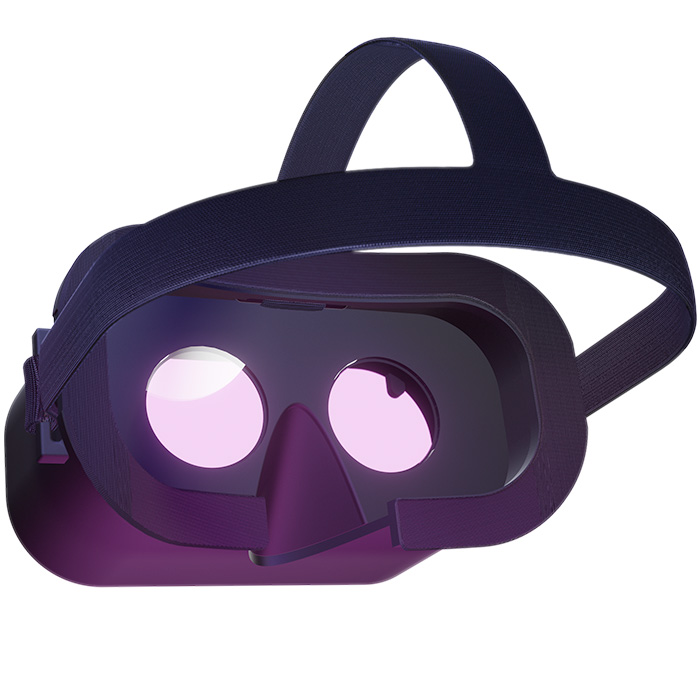

# Relativty is an open-source VR headset with SteamVR support
<p align="center">  </p>

I’m Max Coutte and when my best friend Gabriel Combe and I were 15 years old we built our own VR headset because we couldn't afford to buy one.
5 years later : this headset became Relativty.

**This repo serves as a Build guide, to learn more about the headset see you at: https://www.relativty.com/**

Make it for $200
-
Relativty is **not a consumer product**. We made Relativty in my bedroom with a soldering iron and a 3D printer and we expect you to do the same: **build it yourself**.

To learn more about the features of the Firmware, Software and Hardware visit https://www.relativty.com/

We also have a friendly Discord server, a place for our community to learn, share their knowledge, and ask for help. 
All the links are at: https://www.relativty.com/

Start Building Relativty
-
<p align="center">  </p>

**Building The Hardware**
The hardware is based on the Relativty Motherboard which includes an Atmel SAM3X8E ARM Cortex-M3 processor and uses an MPU-6050 as it’s IMU.
Alternatively, any processor that supports the ArduinoCore and is connected to an MPU-6050 can be used as the hardware for Relativty. Both methods are explained below.

Building The Relativty Motherboard,

**Step 1 - PCB Manufacturing.**

We first start with the naked PCB.

it can be manufactured and bought for around $4 on websites like https://jlcpcb.com/. You’ll need to provide the Gerber file folder `Relativty_Electronics_build/GerberFiles.zip` which describes the shape of the board.


**Step 2 - Assembling** 

soldering the components onto the naked PCB. You’ll have to buy the components listed in one of the two BOMs, depending on availability, `Relativty_Electronics_build/Assembly/jlcpcb.com_motherboard_BOM.csv` or `Relativty_Electronics_build/Assembly/motherboard_BOM.xlsx`

Where to position those components on the PCB is described in the file `Relativty_Electronics_source/motherboard.brd` which can be opened in Eagle.

<p align="center">  </p>

**Using an Arduino**

An alternative to the Relativty Motherboard is to use an Arduino Due and to connect it to an MPU-6050.
<pre>
5V      -> VCC  
GND     -> GND  
SDA(20) -> SDA  
SCL(21) -> SCL  
PIN 2   -> INT  
</pre>
Then push the `ERASE` and the `RESET` button on the Arduino Due and you’ll be able to install the Relativty Firmware.

Installing The Relativty Firmware
-
<p align="center">  </p>
You’ll now need to install the Relativty board in the Arduino IDE. To do that copy that JSON URL: https://raw.githubusercontent.com/relativty/Relativty/master/Relativty_Firmware/package_Relativty_board_index.json and open the Arduino IDE

In Arduino, Click File and then Preferences

Add the JSON URL to the `Additional Boards Manager` text box.

Then go to `Tools > Board > Board Manager` and you should see the Relativty Board, click install.

Reboot the Arduino IDE and under Tools > Boards, select Relativty.

You can now open `Relativty_Firmware/firmware/firmware.ino` and upload it to your board.


Building The Mechanical Parts
-

**Assembling the HMD**

All the files needed for the 3D printing can be found in the `Relativty_Mechanical_build` folder and the screws needed to assemble the Headset are listed in `screws_BOM.xlsx`.

This is the strap we use: https://fr.aliexpress.com/item/33058848848.html, 
his is the foam: https://fr.aliexpress.com/item/4000199486058.html
and this is the lenses: https://fr.aliexpress.com/item/33029909783.html.


**The screen for the HMD**
<p align="center">  </p>

Relativty Headset runs a dual-screen at 120FPS 2K, however, because of the open nature of Relativty you can equip it with any screen.

Our model can be found on Aliexpress, but depending on the vendor similar screens can cost from $180 to $300. This is the model we used: https://fr.aliexpress.com/item/32975198897.html.

Setting Up the Software
-
<p align="center">  </p>

**Installing Relativty Driver for SteamVR**
The Relativty Driver is contained in the `Relativty_Driver/Relativty` folder. You’ll need to set it up by editing the JSON file `Relativty_Driver/Relativty/resources/settings/default.vrsettings` before you install it.

Start by setting `windowX` and `windowY` to the `x` and `y` resolution of your main display. For instance,  
"windowX" : 1920,  
"windowY" : 1080,  

Make sure in your Windows settings that the Relativty’s display is in landscape mode, located at the right of your main display and with theirs tops aligned horizontally.

Then, set `windowWidth`, `windowHeight`, `renderWidth`, and `renderHeight` to the resolution of your Relativty Display.
For instance,  
```
"windowWidth" : 2880,  
"windowHeight" : 1440,  
"renderWidth" : 2880,  
"renderHeight" : 1440,  
```

You can now install Relativty Driver, do so by locating your `vrpathreg.exe` program, usually located at `C:/Steam/steamapps/common/SteamVR/bin/win64/vrpathreg.exe`

Then open the Windows Command Prompt and run the following commands:
`cd C:/Steam/steamapps/common/SteamVR/bin/win64
vrpathreg.exe`

And then assuming your `Relativty_Driver/Relativty` driver folder is located at
`C:/code/Relativty_Driver/Relativty`, run `vrpathreg adddriver C:/code/Relativty_Driver/Relativty`

Relativty Driver is now installed. You can uninstall it any time by running:
`Vrpathreg removedriver C:/code/Relativty_Driver/Relativty`

Setting up the Experimental 3D Tracking
-
The tracking is still very experimental and can only be run on NVIDIA GPU due to the usage of CUDA. The tracking makes uses of only a video input and an Artificial Neural Network AI trained to estimate a 3D body position. This method is nothing close to the precision or freedom of movements of a dedicated sensor however we believe that the model can be trained and improved by orders of magnitude.

You first need to connect a webcam to your computer and install Python 3.8.4 and select the option to add it to the path. Then install `PyTorch`, you can do so by running the following commands:

`python -m pip install torch===1.6.0 torchvision===0.7.0 -f https://download.pytorch.org/whl/torch_stable.html`

Then proceed to install `CUDA Toolkit 11.0.`

You’ll then need to download the Folder `PYTHONPATH` at https://github.com/relativty/Relativty/releases and add its location to `PyPath` in the `JSON Relativty_Driver/Relativty/resources/settings/default.vrsettings`

Set `tracking` to 1. The tracking is now turned on and can be turned off anytime by setting `tracking` to 0.

You’re now all set
-

Everything is now set up to start playing. 
To start using Relativty lay the headset on a flat surface with the front panel facing the ground, then plug in the Headset and It’ll automatically calibrate after a few seconds. 

You can now run any SteamVR game.